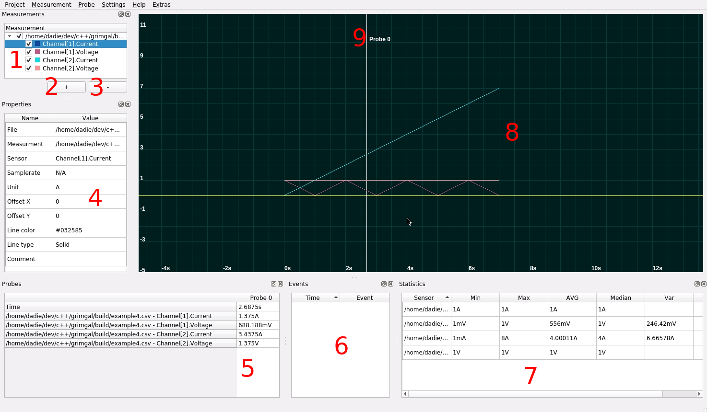

<!-- MarkdownTOC -->

- [GUI Tool to analyse measurement data](#gui-tool-to-analyse-measurement-data)
  - [Usage](#usage)
  - [How to build](#how-to-build)
  - [License](#license)
  - [Acknowledgments](#acknowledgments)

<!-- /MarkdownTOC -->

# GUI Tool to analyse measurement data

Grimgal (**Gr**aph**I**cal **M**easurement processin**G** **A**pp**L**ication) is an open source tool to analyse different types of data used by measurement soft- and hardware.
The tool utilize the [readerlib](https://github.com/MeasureTools/readerlib).

[](https://travis-ci.org/MeasureTools/grimgal)

## Usage




1. Here different Measurements can be modified (e.g. make a measurement or sensor visible or invisible)
2. Button to add a new measurement (otherwise Measurement->Add could also be used)
3. Button to remove the currently selected measurement
4. Here the properties of the selected measurement or sensor from the area 1 are displayed an can be modified
5. Here are all values of each sensor for each probe in table displayed
6. Here are all events of all measurement files
7. Here static information (e.g. AVG) are displayed, if the measurement file format does support this type of information. Otherwise with "Settings->Use Statistic Reader" it is possible to get these statistic information from file formats which doesn't support statistic information.
8. Here the visual data is displayed.
9. Here is an example of the visual representation of a probe.

## How to build

```bash
git clone --recursive https://github.com/MeasureTools/grimgal.git grimgal
cd climgal
mkdir build
cd build
cmake ..
make
```

## License

This project is licensed under a modified BSD 1-Clause License with an additional non-military use clause - see the [LICENSE](LICENSE) file for details.

## Acknowledgments

* TU Dortmund [Embedded System Software Group](https://ess.cs.tu-dortmund.de/EN/Home/index.html) which made this release possible
